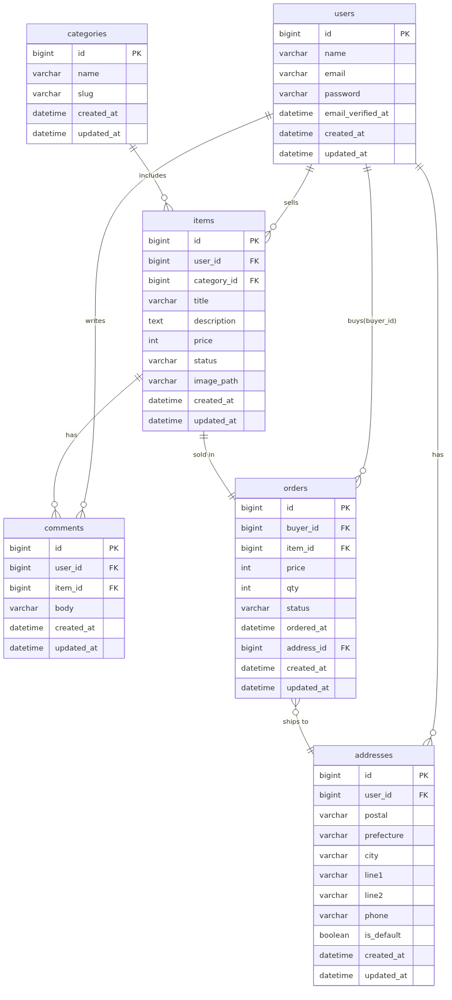

# フリマアプリ

Docker 上で動作する Laravel 製フリマアプリです。  
## 機能
- 一覧: `/` … 仮テンプレ（価格 / いいね数 / 画像サムネ）
- 詳細: `/item/{item}`
- 認証後、コメント投稿、いいね、出品フォーム
- 認証: **Fortify** を導入


## 環境構築
**Dockerビルド**
1. `git clone git@github.com:Estra-Coachtech/laravel-docker-template.git`
2. DockerDesktopアプリを立ち上げる
3. `docker compose up -d --build`

## 使用技術

- PHP **8.1** 
- Laravel **10.x**
- MySQL **8.0**
- Nginx 1.x（PHP-FPM 経由）

## Laravel環境構築
1. `docker compose exec php bash`
2. `composer install`
3. 「.env.example」ファイルを コピーして「.env」を作成し、DBの設定を変更
``` ini
DB_HOST=mysql
DB_DATABASE=laravel_db
DB_USERNAME=laravel_user
DB_PASSWORD=laravel_pass
```

4. アプリケーションキーの作成
``` bash
php artisan key:generate
```

5. マイグレーションの実行
``` bash
php artisan migrate
```

6. シーディングの実行
``` bash
php artisan db:seed
```

<!-- ## 概要
-
-
- -->
## ER 図 / 仕様書
- **ER 図（PNG）**: `docs/img/er.png`  
  
- **ER（Mermaid 元ファイル）**: `docs/er.mmd`
## アクセス

アプリ: http://localhost


phpMyAdmin: http://localhost:8080
