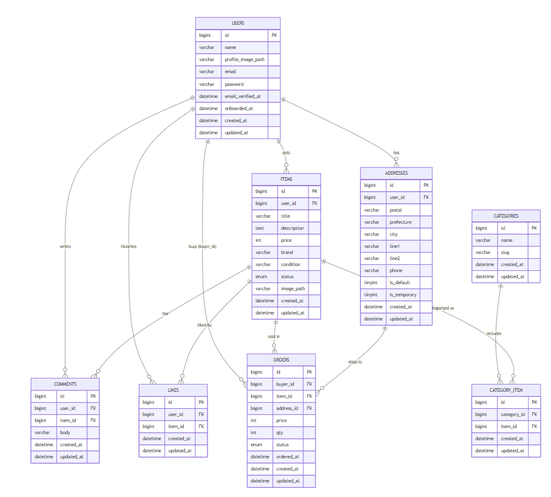

# 📘 テーブル仕様書（DB_SPEC）

このドキュメントは、本アプリで使用している **データベース仕様** をまとめたものです。  
Google スプレッドシートの「テーブル仕様書」シートを Markdown 形式に書き起こした構成です。

---

# 🔗 users テーブル

| カラム名                      | 型            | PK | UK | NN | FK | 説明          |
| ------------------------- | ------------ | -- | -- | -- | -- | ----------- |
| id                        | bigint       | ○  |    | ○  |    | ユーザーID      |
| name                      | varchar(20)  |    |    | ○  |    | 表示名         |
| profile_image_path        | varchar(255) |    |    |    |    | プロフィール画像パス  |
| email                     | varchar(255) |    | ○  | ○  |    | メールアドレス     |
| email_verified_at         | timestamp    |    |    |    |    | メール認証日時     |
| password                  | varchar(255) |    |    | ○  |    | パスワード       |
| two_factor_secret         | text         |    |    |    |    | 2FAシークレット   |
| two_factor_recovery_codes | text         |    |    |    |    | 2FAリカバリーコード |
| two_factor_confirmed_at   | timestamp    |    |    |    |    | 2FA確認日時     |
| remember_token            | varchar(100) |    |    |    |    | ログイントークン    |
| onboarded_at              | timestamp    |    |    |    |    | 初回ログイン完了日時  |
| created_at                | timestamp    |    |    |    |    | 作成日時        |
| updated_at                | timestamp    |    |    |    |    | 更新日時        |

---

# 🔗 categories テーブル

| カラム名    | 型             | PK | UK | NN | FK | 説明 |
|-------------|----------------|:--:|:--:|:--:|:--:|------|
| id          | bigint         | ○ |    | ○ |    | カテゴリID |
| name        | varchar(255)   |    |    | ○ |    | カテゴリ名 |
| slug        | varchar(255)   |    | ○  | ○ |    | URL用スラッグ |

---

# 🔗 items テーブル

| カラム名        | 型                     | PK | UK | NN | FK          | 説明      |
| ----------- | --------------------- | -- | -- | -- | ----------- | ------- |
| id          | bigint                | ○  |    | ○  |             | 商品ID    |
| user_id     | bigint                |    |    | ○  | ○ users(id) | 出品者ユーザー |
| title       | varchar(255)          |    |    | ○  |             | 商品タイトル  |
| description | text                  |    |    |    |             | 商品説明    |
| price       | int                   |    |    | ○  |             | 価格      |
| brand       | varchar(255)          |    |    |    |             | ブランド    |
| condition   | varchar(255)          |    |    |    |             | 商品の状態   |
| status      | enum('active','sold') |    |    | ○  |             | 出品状態    |
| image_path  | varchar(255)          |    |    |    |             | 商品画像パス  |
| created_at  | timestamp             |    |    |    |             | 作成日時    |
| updated_at  | timestamp             |    |    |    |             | 更新日時    |
---

# 🔗 addresses テーブル（配送先）

| カラム名         | 型            | PK | UK | NN | FK          | 説明           |
| ------------ | ------------ | -- | -- | -- | ----------- | ------------ |
| id           | bigint       | ○  |    | ○  |             | 住所ID         |
| user_id      | bigint       |    |    | ○  | ○ users(id) | 所有者ユーザー      |
| postal       | varchar(8)   |    |    | ○  |             | 郵便番号         |
| prefecture   | varchar(64)  |    |    | ○  |             | 都道府県         |
| city         | varchar(128) |    |    | ○  |             | 市区町村         |
| line1        | varchar(255) |    |    | ○  |             | 番地           |
| line2        | varchar(255) |    |    |    |             | 建物名          |
| phone        | varchar(20)  |    |    |    |             | 電話番号         |
| is_default   | tinyint(1)   |    |    | ○  |             | デフォルト住所      |
| is_temporary | tinyint(1)   |    |    |    |             | 購入時だけ使用する仮住所 |
| created_at   | timestamp    |    |    |    |             | 作成日時         |
| updated_at   | timestamp    |    |    |    |             | 更新日時         |

---

# 🔗 orders テーブル（購入）
| カラム名       | 型                                 | PK | UK | NN | FK              | 説明         |
| ---------- | --------------------------------- | -- | -- | -- | --------------- | ---------- |
| id         | bigint                            | ○  |    | ○  |                 | 購入ID       |
| buyer_id   | bigint                            |    |    | ○  | ○ users(id)     | 購入ユーザー     |
| item_id    | bigint                            |    |    | ○  | ○ items(id)     | 購入した商品     |
| address_id | bigint                            |    |    | ○  | ○ addresses(id) | 配送先住所      |
| price      | int                               |    |    | ○  |                 | 購入金額       |
| qty        | int                               |    |    | ○  |                 | 数量（今回は1固定） |
| status     | enum('pending','paid','canceled') |    |    | ○  |                 | 購入状態       |
| ordered_at | datetime                          |    |    |    |                 | 支払い完了日時    |
| created_at | timestamp                         |    |    |    |                 | 作成日時       |
| updated_at | timestamp                         |    |    |    |                 | 更新日時       |

---

# 🔗 likes テーブル（いいね）

| カラム名       | 型         | PK | UK | NN | FK          | 説明        |
| ---------- | --------- | -- | -- | -- | ----------- | --------- |
| id         | bigint    | ○  |    | ○  |             | いいねID     |
| item_id    | bigint    |    |    | ○  | ○ items(id) | いいね対象商品   |
| user_id    | bigint    |    |    | ○  | ○ users(id) | いいねしたユーザー |
| created_at | timestamp |    |    |    |             | 作成日時      |
| updated_at | timestamp |    |    |    |             | 更新日時      |

---

# 🔗 comments テーブル

| カラム名       | 型            | PK | UK | NN | FK          | 説明       |
| ---------- | ------------ | -- | -- | -- | ----------- | -------- |
| id         | bigint       | ○  |    | ○  |             | コメントID   |
| user_id    | bigint       |    |    | ○  | ○ users(id) | 投稿ユーザー   |
| item_id    | bigint       |    |    | ○  | ○ items(id) | コメント対象商品 |
| body       | varchar(255) |    |    | ○  |             | コメント内容   |
| created_at | timestamp    |    |    |    |             | 作成日時     |
| updated_at | timestamp    |    |    |    |             | 更新日時     |

---

# 🔗 category_item（カテゴリ中間）テーブル

| カラム名        | 型         | PK | UK | NN | FK               | 説明     |
| ----------- | --------- | -- | -- | -- | ---------------- | ------ |
| id          | bigint    | ○  |    | ○  |                  | 中間ID   |
| category_id | bigint    |    |    | ○  | ○ categories(id) | カテゴリID |
| item_id     | bigint    |    |    | ○  | ○ items(id)      | 商品ID   |
| created_at  | timestamp |    |    |    |                  | 作成日時   |
| updated_at  | timestamp |    |    |    |                  | 更新日時   |

# 🗄️ ER 図（PNG）

アプリで使用する ER 図は以下の通りです：

---

