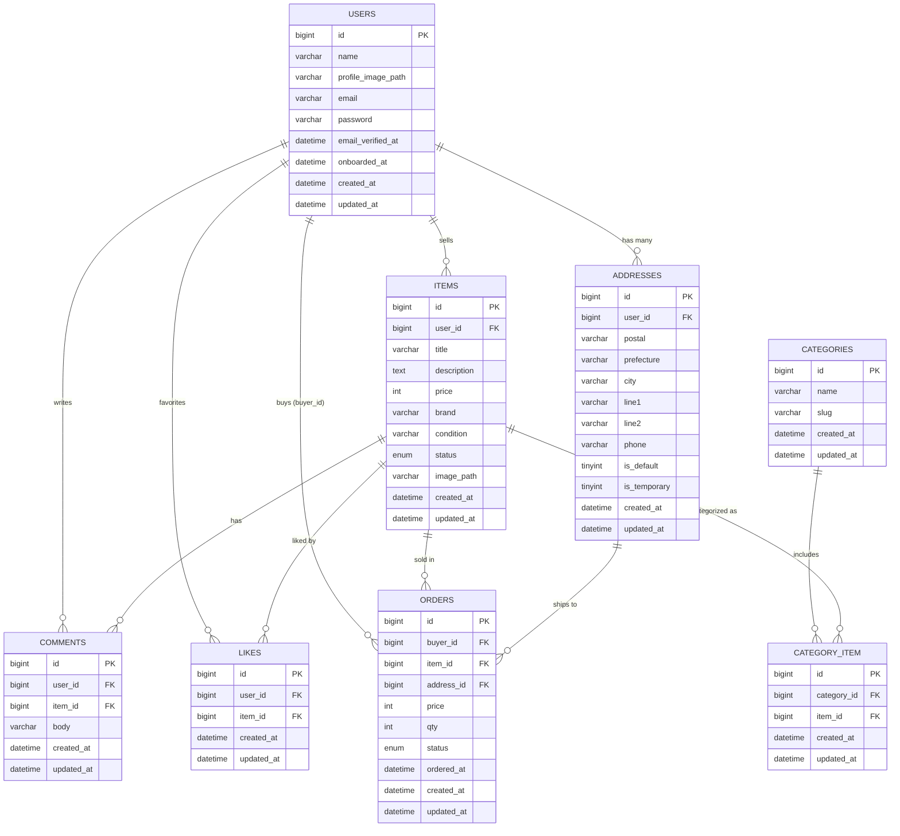

# ER 図（Mermaid）

```mermaid
erDiagram
    USERS ||--o{ ITEMS : "sells"
    USERS ||--o{ COMMENTS : "writes"
    USERS ||--o{ LIKES : "favorites"
    USERS ||--o{ ORDERS : "buys (buyer_id)"
    USERS ||--o{ ADDRESSES : "has many"
    ITEMS ||--o{ COMMENTS : "has"
    ITEMS ||--o{ LIKES : "liked by"
    ITEMS ||--o{ ORDERS : "sold in"

    ADDRESSES ||--o{ ORDERS : "ships to"

    CATEGORIES ||--o{ CATEGORY_ITEM : "includes"
    ITEMS ||--o{ CATEGORY_ITEM : "categorized as"

    USERS {
        bigint id PK
        varchar name
        varchar profile_image_path
        varchar email
        varchar password
        datetime email_verified_at
        datetime onboarded_at
        datetime created_at
        datetime updated_at
    }

    ADDRESSES {
        bigint id PK
        bigint user_id FK
        varchar postal
        varchar prefecture
        varchar city
        varchar line1
        varchar line2
        varchar phone
        tinyint is_default
        tinyint is_temporary
        datetime created_at
        datetime updated_at
    }

    ITEMS {
        bigint id PK
        bigint user_id FK
        varchar title
        text description
        int price
        varchar brand
        varchar condition
        enum status
        varchar image_path
        datetime created_at
        datetime updated_at
    }

    COMMENTS {
        bigint id PK
        bigint user_id FK
        bigint item_id FK
        varchar body
        datetime created_at
        datetime updated_at
    }

    LIKES {
        bigint id PK
        bigint user_id FK
        bigint item_id FK
        datetime created_at
        datetime updated_at
    }

    ORDERS {
        bigint id PK
        bigint buyer_id FK
        bigint item_id FK
        bigint address_id FK
        int price
        int qty
        enum status
        datetime ordered_at
        datetime created_at
        datetime updated_at
    }

    CATEGORIES {
        bigint id PK
        varchar name
        varchar slug
        datetime created_at
        datetime updated_at
    }

    CATEGORY_ITEM {
        bigint id PK
        bigint category_id FK
        bigint item_id FK
        datetime created_at
        datetime updated_at
    }
```